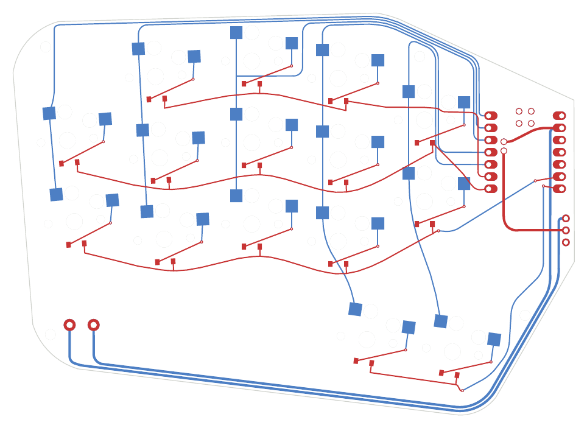
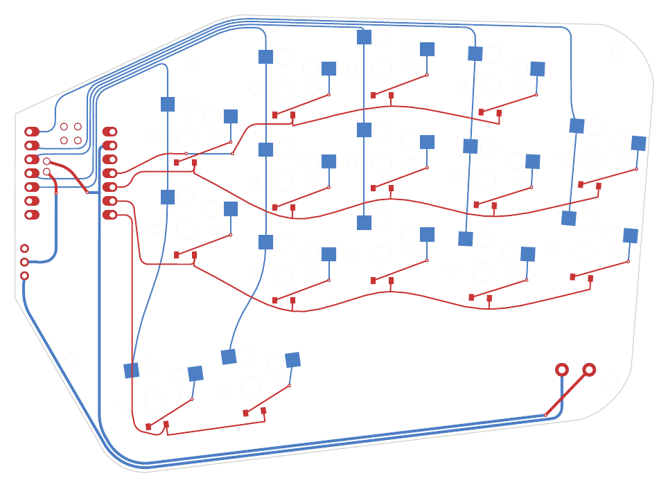
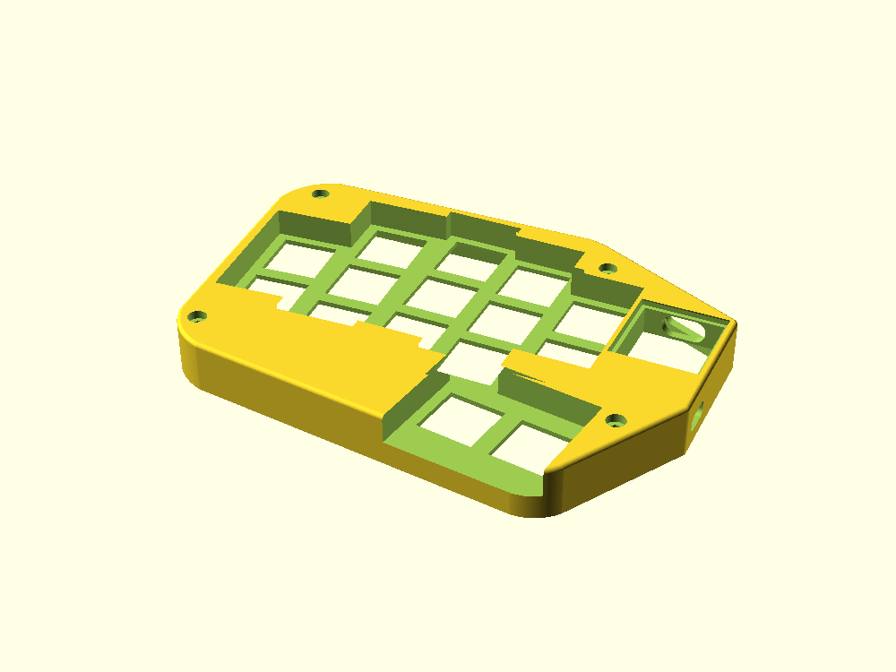
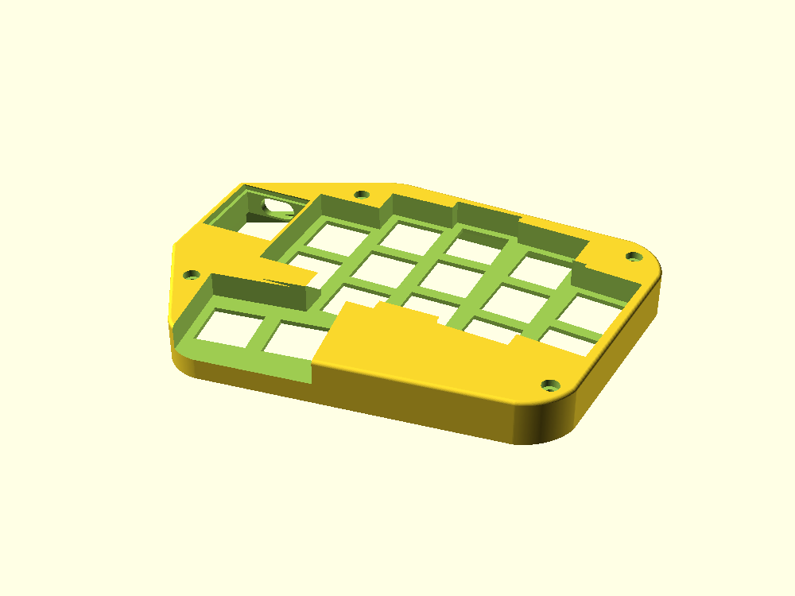
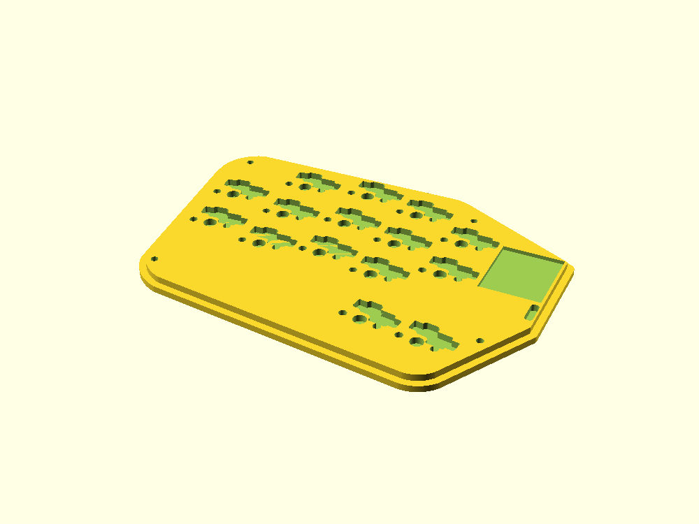
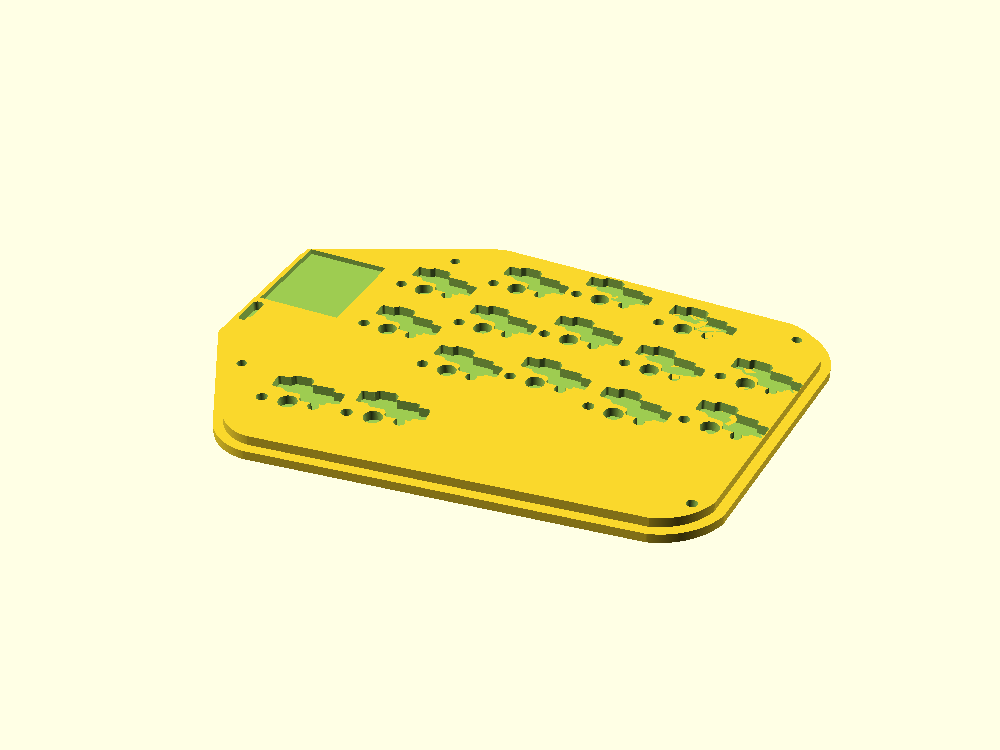

> ⚠️ **Work in progress — do not build this yet.** The PCB, case, and firmware have not been validated against a physical build. Things will change, things may be wrong. Watch the commits if you want to follow along, but don't order boards from these files yet.

# Eidolon

> **eidolon** /aɪˈdoʊlɒn/ *noun*
> An idealized image; a phantom or spectre of a person or thing.
> — from Greek εἴδωλον *(image, idol, phantom)*

---

A small column-staggered wireless split keyboard. 30 keys (5×3 + 2 thumb per half), Kailh Choc v1 switches, Seeed XIAO nRF52840 BLE, Totem-style clamshell case. Both halves are independent wireless units — no TRRS cable.

## Built on the shoulders of

| Keyboard | Role in this project |
|----------|----------------------|
| [**Phantom**](https://github.com/davidphilipbarr/Phantom) by davidphilipbarr | PCB layout source — key positions reverse-engineered from `lephantom.kicad_pcb`; board outline traced from the original `Edge.Cuts`. Eidolon matches the original key centres to < 0.15 mm. |
| [**TOTEM**](https://github.com/GEIGEIGEIST/TOTEM) by GEIGEIGEIST | Case design reference — switch hole dimensions, keycap recess depth, clamshell geometry, and hot-swap socket pocket profiles from the Totem STEP file; the XIAO BLE SMD footprint (`pcb/footprints/xiao_ble.js`) is adapted from Totem's `xiao-ble-smd-cutout`. |
| [**Rufous**](https://github.com/jcmkk3/trochilidae/) by jcmkk3 | Diode placement — diodes sit in each Choc south LED cutout following the Rufous approach. (`pcb/footprints/xiao_pogo.js`, a pogo-pin XIAO mount adapted from Rufous, is kept as an unused alternative to the SMD footprint.) |

## PCB

| Left half | Right half |
|-----------|-----------|
|  |  |

## Case

| Top — left | Top — right |
|------------|-------------|
|  |  |

| Bottom — left | Bottom — right |
|---------------|----------------|
|  |  |

---

## Repository layout

```
pcb/              Ergogen source + routed KiCad files + gerbers
  eidolon.yaml      Ergogen config (geometry + nets)
  footprints/       custom Ergogen footprints
  build.js          local build wrapper (injects footprints)
  eidolon_left.kicad_pcb   routed left half
  eidolon_right.kicad_pcb  routed right half
  eidolon_left_gerbers.zip
  eidolon_right_gerbers.zip

case/             OpenSCAD case design
  eidolon_case.scad        top shell (both halves via -D right=true)
  eidolon_case_bottom.scad bottom shell
  stl/                     pre-generated STL files
```

---

## PCB build (Ergogen)

Custom footprints live in `pcb/footprints/`, so use the wrapper rather than the ergogen CLI directly:

```sh
cd pcb
npm install       # once
node build.js     # -> pcb/output/
```

Outputs land in `pcb/output/`:
- `outlines/board_left.svg|dxf`, `board_right.svg|dxf` — board perimeters
- `pcbs/eidolon_left.kicad_pcb`, `eidolon_right.kicad_pcb` — both halves, footprints + nets placed (no routes)

On **ergogen.xyz**, paste each file in `pcb/footprints/` into the web app's Footprints section under its filename (e.g. `reset_button`); `eidolon.yaml` then works as-is.

### Layout

```
 pinky  ring  middle index inner
   ·    top    top   top   ·       (pinky has no top row; inner has no bottom)
 home  home   home  home  upper
 bot   bot    bot   bot   lower
                  thumbL thumbR    (-8°)
```

Pinky splayed 5°, ring splayed 3°; other columns straight. Choc spacing: 18 mm columns, 17 mm rows.

### Wiring — COL2ROW diode matrix (XIAO BLE)

Each half is a fully independent wireless unit (own XIAO + battery, no TRRS), so the two halves carry **independent pin maps**. The columns are identical; the rows are assigned per half to keep each MCU's fan-out clean.

| Matrix | Net | XIAO pin (left) | XIAO pin (right) |
|--------|-----|-----------------|------------------|
| pinky col  | C0 | D0 | D0 |
| ring col   | C1 | D1 | D1 |
| middle col | C2 | D2 | D2 |
| index col  | C3 | D3 | D3 |
| inner col  | C4 | D4 | D4 |
| top row    | R0 | D5 | D10 |
| home row   | R1 | D6 | D9  |
| bottom row | R2 | D8 | D8  |
| thumb row  | R3 | D7 | D7  |

On the right half all four rows sit on the matrix-facing `D7`–`D10` edge (`D5`/`D6` spare), so only the five columns cross the MCU — the physical minimum. **The two halves therefore need different `MATRIX_ROW_PINS` in firmware.**

Power: battery + → `RAW_BATT` → slide switch → `BATT` → XIAO `B+`; battery − → GND.

> **Verify before fab:** the XIAO pad→pin mapping lives in `pcb/footprints/xiao_ble.js` (surface-mount, mounted **face-up** over the PCB). It was corrected and checked against the XIAO datasheet and the TOTEM `xiao-ble-smd-cutout` footprint — re-confirm before ordering.

### Mirrored halves, not reversible

The original Phantom is a single reversible PCB flipped for both hands. Eidolon generates a true left and right board. Because each half is an independent wireless unit with its own firmware, the halves do **not** share a pin map — the right half's `MATRIX_ROW_PINS` differ from the left's (see the per-half table above).

---

## Case (OpenSCAD)

`case/eidolon_case.scad` is the top shell for both halves. The right half is the left mirrored (`-D right=true`).

```sh
openscad -o case/stl/eidolon_case_top_left.stl  case/eidolon_case.scad
openscad -D right=true -o case/stl/eidolon_case_top_right.stl  case/eidolon_case.scad
openscad -o case/stl/eidolon_case_bottom_left.stl  case/eidolon_case_bottom.scad
openscad -D right=true -o case/stl/eidolon_case_bottom_right.stl  case/eidolon_case_bottom.scad
```

Pre-generated STLs are in `case/stl/`.

Top shell features: keycap recess field, stepped 13.8 mm Choc plate holes, XIAO pocket with acrylic window rebate + USB-C cutout, battery pocket, power-switch wall slot, M2 bolt pockets.

### Bottom shell

`case/eidolon_case_bottom.scad` nests inside the top from below. Geometry:

- z ∈ [−2.0, 0]: exterior plate (`floor_t` = 2.0 mm) matching the top case outer footprint
- z ∈ [0, 2.1]: nesting lip; PCB rests on the lip top at z = 2.1
- Per-switch hot-swap socket pockets cut into the lip — traced from the Kailh PG1350 socket silkscreen (plastic body **plus** both SMD pad rectangles), inflated by `socket_clr` = 0.6 mm
- Choc plastic-pin, power-switch-leg, and XIAO underside-joint clearance pockets in the lip
- M2 hex nut pockets (4.0 mm AF × 1.8 mm) at the four bolt positions
- Four Ø8.4 × 1.8 mm bumpon pockets in the underside (≥7.5 mm clear of the nut pockets)

### Mounting hardware

| Part | Spec | Count |
|------|------|-------|
| Socket cap bolt | M2 × 12 mm | 4 per half |
| Hex nut | M2 (4.0 mm AF) | 4 per half |

### MCU acrylic window

Cut a piece of 1.5 mm clear acrylic to drop into the XIAO rebate:

| Dimension | Size |
|-----------|------|
| Width | 20.3 mm |
| Length | 22.8 mm |
| Thickness | 1.5 mm |

Angle the acrylic, slip the +y edge under the square lip (lip A), press the −y edge down past the chamfered lip (lip B). Remove the bottom shell to access the MCU.

---

## Firmware

ZMK firmware for the Eidolon is available at [jonnyirwin/zmk-keyboard-eidolon](https://github.com/jonnyirwin/zmk-keyboard-eidolon).

---

## Deviations from the original Phantom

- **Mirrored L/R** instead of a single reversible board.
- **BLE only** — XIAO nRF52840, COL2ROW diode matrix, battery + slide switch; Pro Micro and TRRS removed.
- **Diodes top-side**, in each Choc south LED gap — hotswap sockets are the only underside component.
- **Trackball omitted.**
- Board outline is the original `Edge.Cuts` polygon with 1.5 mm corner fillets.
